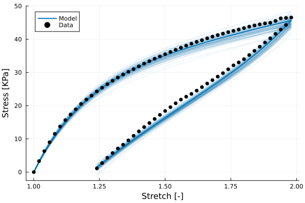
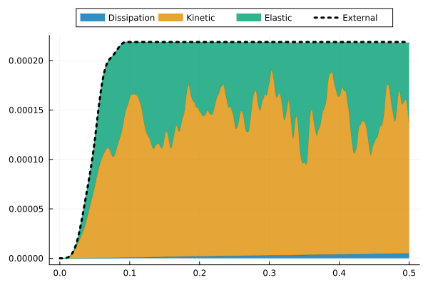

# 2026-ViscousPolyconvex

Numerical examples showcasing the use of the viscous model implemented in [HyperFEM](https://github.com/MultiSimOLab/HyperFEM.jl) ([viscous polyconvex](https://github.com/MultiSimOLab/HyperFEM.jl/blob/main/src/PhysicalModels/ViscousPolyconvex.jl)).

## VHB 4910 characterization

The material characterization has been performed with the [HyperCalibration](https://github.com/miguelmaso/HyperCalibration.jl) library, and the data is described in the [data](https://github.com/miguelmaso/2026-ViscousPolyconvex/tree/main/calibration/data) folder. A *neo-Hookean* constitutive model has been selected both for the equilibrium and the non-equilibrium terms, and the optimal parameters -shear moduli and relaxation times- for the two-branch model are summarized below. The calibration script fixes the seed of the random number generator, so that the particle swarm optimization and the uncertainty sampling are reproducible:

Parameter | Estimate ± Margin  | Rel. Err (%) | Sensitivity
----------|--------------------|--------------|----------
μₑ [Pa]   | 1.34e+04 ± 92      | 0.7          | 1278.6
μ₁ [Pa]   | 1.11e+04 ± 2.9e+03 | 26.1         | 45.9
τ₁ [s]    |      152 ± 80      | 52.7         | 5.3
μ₂ [Pa]   | 3.05e+04 ± 3.6e+03 | 11.7         | 19.8
τ₂ [s]    |     7.07 ± 2       | 28.0         | 13.0

The figure below presents the uncertainty inherent to the confidence intervals reported in the summary table. For the sake of clarity, a single experiment is depicted, specifically, at maximum stretch 100% and loading rate 0.03/s.

## Numerical example

Dynamic integration of a thin membrane with out-of-plane displacement. The previously characterized constitutive model is used for the simulation.

The image below presents the energy balance for a simulation with a Neumann boundary condition applied at the center of the membrane. From time *t=0* to *t=0.1* the force follows a triangular evolution law, having the maximum at time *t=0.05*. From *t=0.1* and up, the force is constant and equal to *0N*.

