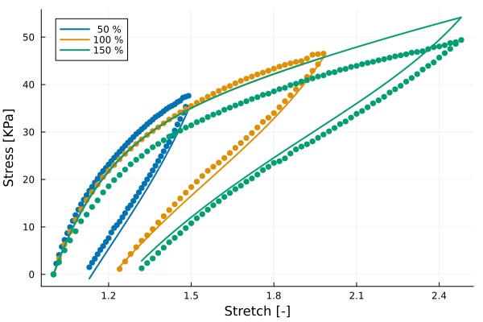
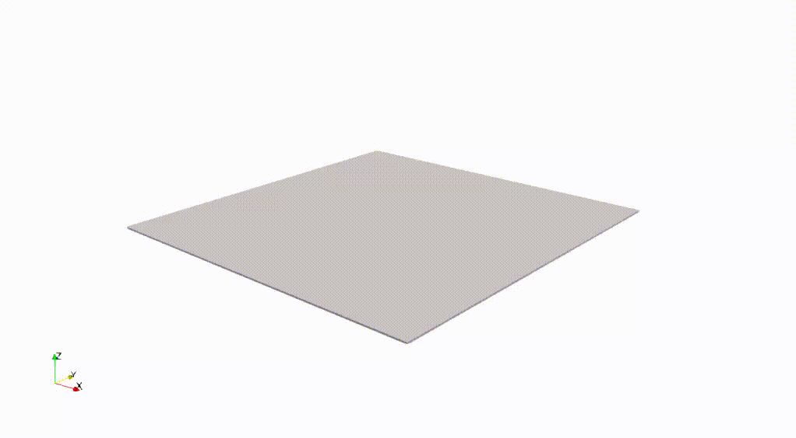

# 2026-ViscousPolyconvex

Numerical examples showcasing the use of the viscous model implemented in [HyperFEM](https://github.com/MultiSimOLab/HyperFEM.jl) ([viscous polyconvex](https://github.com/MultiSimOLab/HyperFEM.jl/blob/main/src/PhysicalModels/ViscousPolyconvex.jl)).

## VHB 4905 characterization

Parameters fitted with the [HyperCalibration](https://github.com/miguelmaso/HyperCalibration.jl) library:

Parameter | Estimate ± Margin  | Rel. Err (%) | Sensitivity
----------|--------------------|--------------|----------
μe        | 1.34e+04 ± 2.4e+02 | 1.8          | 1278.6
μ1        | 2.99e+04 ± 1.1e+03 | 3.7          | 20.9      
t1        |     7.52 ± 0.59    | 7.9          | 13.5      
μ2        | 1.07e+04 ± 5e+02   | 4.7          | 44.2      
t2        |      159 ± 14      | 8.8          | 4.9

## Numerical example

Dynamic integration of a thin membrane with out-of-plane displacement.

